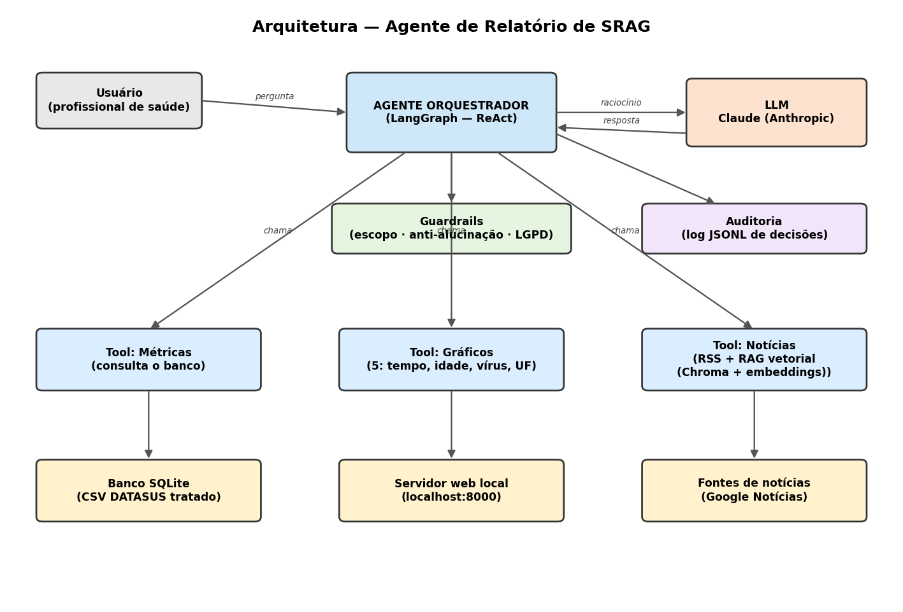

# Agente de Relatório de SRAG — Indicium HealthCare (PoC)

Solução de IA Generativa que gera, de forma automatizada, um **relatório de
vigilância epidemiológica da SRAG** (Síndrome Respiratória Aguda Grave). Um
**agente orquestrador** consulta um banco de dados oficial para calcular
métricas, busca **notícias em tempo real** para contextualizar o cenário e
produz um relatório com métricas, gráficos e uma análise textual.

Dados: [Open DATASUS — SRAG 2019 a 2026](https://dadosabertos.saude.gov.br/dataset/srag-2019-a-2026)
(Sistema SIVEP-Gripe).

---

## 1. O que o relatório entrega

**Quatro métricas** (todas calculadas a partir dos dados oficiais, nunca
estimadas pelo LLM):

| Métrica | Definição usada |
|---|---|
| Taxa de aumento de casos | Variação % dos casos nos últimos 30 dias vs. os 30 dias anteriores |
| Taxa de mortalidade | Óbitos ÷ casos com desfecho conhecido (últimos 12 meses) |
| Taxa de ocupação de UTI | Casos que foram para UTI ÷ casos com status de UTI conhecido |
| Taxa de vacinação | Vacinados ÷ casos com status de vacinação conhecido |

**Cinco gráficos:** os 2 exigidos — casos diários (últimos 30 dias) e casos
mensais (últimos 12 meses) — mais 3 de perfil: casos e óbitos por faixa etária,
casos por classificação final (tipo de vírus) e casos por estado (top UFs).

**Uma análise textual** gerada pelo LLM (Claude), que interpreta as métricas
usando as notícias apenas como contexto.

> O relatório é servido em `http://localhost:8000/`; o diagrama de arquitetura
> está em `docs/arquitetura.pdf`.

---

## 2. Arquitetura



O **Agente Orquestrador** (LangGraph, padrão ReAct) recebe uma instrução e decide
quais **Tools** chamar. Cada tool é um adaptador fino sobre a lógica testável:

- **Tool de Métricas** → consulta o banco **SQLite** (gerado a partir do CSV do
  DATASUS já tratado) e calcula as 4 métricas.
- **Tool de Gráficos** → gera os 5 gráficos (2 exigidos + 3 de perfil).
- **Tool de Notícias** → busca manchetes recentes de SRAG (RSS do Google
  Notícias, em tempo real).
- **RAG completo** → as notícias e o dicionário de dados são divididos em chunks,
  transformados em embeddings (**sentence-transformers**, local) e indexados num
  **banco vetorial (Chroma)**. Antes de comentar as métricas, o sistema recupera
  por similaridade os trechos mais relevantes ao cenário e os injeta no contexto
  do LLM. Embedder e índice são injetáveis (fallback sem dependências pesadas).

Duas camadas transversais atravessam todo o fluxo:

- **Guardrails** — validam escopo, bloqueiam alucinação de números e protegem
  dados sensíveis.
- **Auditoria** — registra cada decisão/chamada de tool em `logs/audit.jsonl`.

O **LLM (Claude)** entra apenas para **interpretar** os números que as tools
entregaram — ele nunca calcula nem inventa métricas.

---

## 3. Decisão de arquitetura: a "data de referência"

O arquivo de exemplo é o banco de **2019**, mas o relatório pede métricas dos
"últimos 30 dias / 12 meses". Em vez de fixar uma data, o sistema usa uma
**data de referência**: por padrão, o **último dia presente nos dados** é
tratado como "hoje" (ver `config.py`).

**Por quê:** o mesmo código funciona com qualquer ano. O pipeline lê **todos os
`INFLUD*.csv` que estiverem em `data/`** e consolida **2019 a 2026** num único
banco. Para dados atuais, basta baixar os CSVs dos anos desejados (inclusive o
banco vivo de 2025/2026), jogar em `data/` e rodar `--construir-banco`.

**Arquivos grandes, tratados em código.** Os CSVs somam ~4,7 GB (2020 e 2021 têm
mais de 1 GB cada). Para não estourar a memória, cada arquivo é lido **em blocos**
(`chunksize`) e **só com as ~17 colunas necessárias** (`usecols`), limpo,
anonimizado e **acrescentado** ao SQLite; o cache de disco é liberado entre
arquivos. Assim o LLM nunca vê o arquivo — só métricas agregadas — e mesmo o
processamento carrega apenas o mínimo. No relatório, cada página carrega apenas a
**janela de datas necessária** (via `WHERE` no SQL), não os 5,5 milhões de linhas.

---

## 4. Tratamento dos dados (dados reais são sujos)

O CSV tem ~194 colunas e vem com erros de preenchimento. O pipeline
(`data_pipeline.py`):

1. Lê com separador `;` e todos os campos como texto (evita conversões erradas).
2. Seleciona apenas as colunas relevantes (reduz ruído e dado sensível carregado).
3. Converte datas e **remove datas impossíveis** — encontramos, por exemplo,
   `DT_INTERNA` no ano **2109**.
4. Descarta registros sem data de primeiros sintomas (`DT_SIN_PRI`), que é a base
   da série temporal.
5. **Normaliza códigos inconsistentes**: a coluna `EVOLUCAO` vem como `"2.0"`
   enquanto `UTI` vem como `"2"`. Uniformizamos para bater com o dicionário.

### Limitações honestas (importantes)

- **"Ocupação de UTI"** aqui é a *proporção de casos que foram para UTI*, não a
  ocupação de leitos — os dados são um registro por caso e não trazem o total de
  leitos disponíveis.
- **Vacinação em 2019** usa a vacina da **gripe** (`VACINA`), pois a coluna de
  vacina COVID (`VACINA_COV`) está praticamente vazia (a vacina não existia). O
  código escolhe a fonte automaticamente conforme a disponibilidade do dado.
- Há **subnotificação e campos ausentes**; por isso os denominadores usam apenas
  casos com status conhecido, e isso fica registrado no detalhe de cada métrica.

---

## 5. Governança, guardrails e dados sensíveis

**Governança e transparência.** Cada métrica carrega numerador, denominador e
uma explicação da conta. Todo o processo é auditado em `logs/audit.jsonl` (uma
linha JSON por evento), permitindo reconstruir *por que* o agente disse o que
disse.

**Guardrails** (`guardrails.py`):

- *Escopo* — recusa perguntas fora do domínio de SRAG/saúde.
- *Anti-alucinação* — confere se todo percentual citado no texto do LLM
  corresponde a uma métrica realmente calculada. Se um número não confere, o
  guardrail **não afirma que está errado** (não temos essa certeza) e **não
  descarta a análise** — ele preserva o texto e acrescenta uma **observação**
  nomeando o valor não verificado, para o leitor conferir.
- *Dados sensíveis (rede de segurança na saída)* — mesmo com o dado entrando já
  anonimizado, o guardrail ainda varre o texto **gerado pelo LLM** e mascara
  qualquer coisa com formato de CPF ou nome individual. É defesa em profundidade —
  não porque a entrada tenha identificadores, mas para o caso de o modelo inventar
  um valor ou de uma fonte futura ser menos limpa.

**Dados sensíveis (LGPD).** As bases do DATASUS já vêm **anonimizadas** (Lei
13.709/2018), sem nome/CPF/CNS. Ainda restam **quase-identificadores** (data de
nascimento, sexo, raça, município, ocupação). Como defesa em profundidade: (a)
carregamos só as colunas necessárias — ocupação nem entra; (b) na ingestão,
`DT_NASC` é **generalizada para só o ano** e dia/mês são descartados; (c)
trabalhamos sempre de forma agregada; e (d) como **rede de segurança**, ainda
mascaramos na saída do LLM qualquer coisa com formato de CPF/nome — mesmo a entrada
já não tendo esses campos. São camadas distintas: a anonimização (a–c) garante que
nenhum identificador **entra**; o mascaramento (d) protege o que **sai**. O LLM
nunca recebe linhas de paciente.

---

## 6. Como executar

```bash
# 1) Instalar dependências
pip install -r requirements.txt

# 2) Configurar a chave da API
cp .env.example .env      # edite e coloque sua ANTHROPIC_API_KEY

# 3) Colocar os CSVs do DATASUS em data/ (um ou vários anos: INFLUD*.csv)

# 4) Construir o banco tratado — lê TODOS os INFLUD*.csv e consolida 2019–2026
#    (leitura em blocos; arquivos grandes são processados sem estourar a memória)
python src/main.py --construir-banco

# 5) Iniciar o servidor do relatório (abre o navegador automaticamente)
python src/main.py
#    → serve em http://localhost:8000/ e abre o navegador na página viva

# (opcional) Usar o agente ReAct decidindo as tools sozinho
python src/main.py --agente "Gere o relatório de SRAG do cenário atual"
```

> O banco já incluído em `data/srag.db` traz os anos **2025–2026** (dados atuais,
> pronto para uso imediato). Rode `--construir-banco` para reconstruir a base
> completa **2019–2026** a partir dos CSVs em `data/`.

O relatório é **servido por um servidor web local** (`src/app.py`): `main.py`
sobe o servidor e abre o navegador em `http://localhost:8000/`. Tudo é **gerado
sob demanda em memória** (métricas, gráficos e análise) — não há arquivo HTML nem
imagens escritos em disco.

A arquitetura tem duas partes: uma **página persistente** (cabeçalho fixo com o
date picker, rota `/`, leve e instantânea) e o **conteúdo** (rota `/conteudo`,
carregado por `fetch` com um spinner local). Ao **trocar a data**, só o conteúdo é
recarregado — o cabeçalho permanece, sem recarregar a página inteira.

Na barra compacta **à direita do cabeçalho** há um **date picker** cujo padrão é
sempre a **data mais recente**: como o DATASUS cobre um período longo, dá para
escolher a data de referência e o relatório recalcula as métricas/gráficos "até
aquela data". Data **fora do período disponível** mostra um aviso e usa o período
mais recente. O botão "↻ Atualizar dados" regenera o conteúdo (cacheado por data
para não repetir a chamada ao LLM).

**Análise do cenário:** é sempre escrita pelo **LLM (Claude)**. Sem
`ANTHROPIC_API_KEY` — ou em caso de falha da API — a seção mostra um aviso honesto
("Análise indisponível…") em vez de um texto que finja ser análise. As métricas e
os gráficos são gerados a partir dos dados de qualquer forma.

**Notícias recentes:** só são preenchidas quando há **acesso à internet** (o feed
do Google Notícias). Busca **até 10** manchetes, ordenadas da mais recente para a
mais antiga, e a seção é **paginada** (até **10 por página**, com **← Anterior · n/m ·
Próxima →**). Sem internet, a seção informa que nenhuma notícia foi recuperada, sem
quebrar o relatório.

---

## 6.1. Testes (TDD)

O projeto foi **desenvolvido em TDD** (test-first): para cada módulo, os testes
foram escritos primeiro (RED), depois a implementação mínima para passar (GREEN),
seguida de refatoração. A suíte usa **pytest** e não toca o CSV real, a internet
nem a API — apenas dados sintéticos, bancos SQLite temporários e mocks.

```bash
pip install -r requirements.txt
pytest                      # roda toda a suíte
pytest --cov=src            # com relatório de cobertura
```

**123 testes**, cobrindo: cálculo das 4 métricas (com casos-limite e backtesting), anonimização e tratamento
do CSV sujo (datas impossíveis, códigos `.0`), guardrails, parsing de notícias,
o **RAG** (chunking, índice vetorial, recuperação), geração de gráficos,
auditoria, o agente (com LLM e rede mockados), o CLI, o gerador de diagrama e o
relatório de ponta a ponta. **Cobertura total de ~91%**; o que resta descoberto é
a rede real, a chamada real ao LLM, os backends pesados do RAG (Chroma /
sentence-transformers) e os guardas `if __name__ == "__main__"`.

Para tornar o código testável, duas partes de I/O foram isoladas da lógica pura:
o *download* do RSS (`_baixar_rss`) é separado do *parsing* (`_parse_rss`), e a
chamada ao LLM fica numa função única (`_invocar_llm`) fácil de substituir nos
testes.

---

## 7. Estrutura do projeto

```
srag-agent/
├── README.md
├── requirements.txt
├── pytest.ini                # configuração dos testes
├── .env.example
├── data/                     # CSV bruto do DATASUS + banco SQLite (não versionados)
├── docs/
│   ├── arquitetura.pdf       # diagrama conceitual da arquitetura
│   ├── DOCUMENTACAO.md       # documentação técnica (módulo a módulo, decisões)
│   └── PLANO_MELHORIAS.md    # plano/registro das melhorias
├── logs/
│   └── audit.jsonl           # log de auditoria (JSON Lines, rotacionado por tamanho)
├── .github/workflows/
│   └── tests.yml             # CI: pytest (matriz 3.10-3.12) + cobertura + ruff + mypy
├── ruff.toml                 # configuração do lint
├── tests/                    # suíte pytest (TDD) - 123 testes
│   ├── conftest.py           # fixtures (dados sintéticos, banco/pastas temporárias)
│   ├── test_metrics.py       # métricas + IC + UTI/CNES + suavização
│   ├── test_backtest.py      # valores conferidos à mão (backtesting)
│   ├── test_data_pipeline.py # limpeza, anonimização, multi-ano em blocos
│   ├── test_agregados.py     # paridade agregado x linhas cruas
│   ├── test_atualizar.py     # download do banco vivo + rebuild
│   ├── test_guardrails.py    # escopo, anti-alucinação, anti-injeção, mascaramento
│   ├── test_news_tool.py     # parsing RSS, múltiplas fontes, dedup
│   ├── test_charts.py        # gráficos PNG
│   ├── test_charts_web.py    # gráficos interativos (Chart.js)
│   ├── test_rag.py           # chunking, índice vetorial, recuperação
│   ├── test_audit.py         # auditoria + rotação
│   ├── test_agent.py         # análise por LLM e modo agente
│   ├── test_regressao.py     # regressão de prompt + tracing
│   ├── test_agent_tools.py   # tools do agente
│   ├── test_app.py           # cache/roteamento do servidor
│   ├── test_integracao.py    # sobe o servidor e bate nas rotas
│   ├── test_main.py          # CLI
│   ├── test_make_diagram.py  # geração do diagrama
│   └── test_report.py        # página + conteúdo
└── src/
    ├── config.py             # configuração central (caminhos, colunas, códigos, agregados)
    ├── data_pipeline.py      # CSV sujo -> SQLite tratado + tabelas agregadas
    ├── agregados.py          # métricas e séries lidas das tabelas-resumo (rápido)
    ├── metrics.py            # cálculo das 4 métricas + IC95% (oráculo dos testes)
    ├── charts.py             # os 5 gráficos em PNG (matplotlib)
    ├── charts_web.py         # versão interativa dos gráficos (Chart.js, hover)
    ├── atualizar_dados.py    # download do banco vivo + rebuild (--atualizar)
    ├── guardrails.py         # escopo, anti-alucinação, anti-injeção, mascaramento
    ├── audit.py              # registro de auditoria (JSON Lines, com rotação)
    ├── rag.py                # RAG completo (chunking, embeddings, banco vetorial)
    ├── knowledge.py          # dicionário + fontes oficiais (corpus do RAG)
    ├── agent.py              # agente orquestrador (LangGraph + Claude) + modo agente
    ├── report.py             # página + conteúdo (métricas, gráficos, análise)
    ├── app.py                # servidor web local (rotas / e /conteudo)
    ├── main.py               # CLI (--construir-banco, --agente, --atualizar)
    └── make_diagram.py       # gera o diagrama de arquitetura (PDF)
```

---

## 8. Melhorias implementadas

Sobre a base da PoC foram feitas melhorias em TDD (detalhes em
`docs/PLANO_MELHORIAS.md` e `docs/DOCUMENTACAO.md`):

- **Desempenho:** pré-agregação na ingestão — qualquer data responde em ~1 s (a janela
  do pico de 2020-21 caiu de ~3,7 GB / 19 s para ~124 MB / 1,5 s), com paridade de
  métricas garantida por teste.
- **Dados atuais:** consolidação multi-ano (2019-2026) e atualização automática do
  banco vivo (`--atualizar`), com selo de "base atualizada em".
- **Governança / segurança:** guardrail anti prompt-injection nas notícias;
  mascaramento ampliado (CPF, CNS, telefone, e-mail); rotação do log de auditoria.
- **Agente:** modo agente na página (o ReAct decide as tools) com os mesmos guardrails;
  RAG com múltiplas fontes + deduplicação e rodapé "Fontes consultadas" (grounding).
- **Métricas / UX:** intervalos de confiança (IC95%) nas proporções; gráficos
  interativos com hover (Chart.js).
- **Qualidade:** 123 testes (incl. regressão de prompt, backtesting e integração),
  cobertura ~92%, e CI com matriz de Python + lint (ruff) + tipos (mypy).
